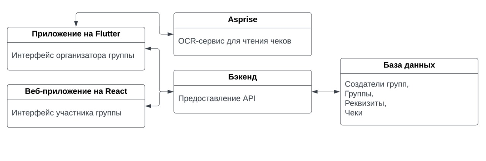

# Голодный калькулятор 

## Описание

Решение для разделения позиций чека между участниками компании и возврата средств от участников плательщику

Для организатора группы:
- Создание группы с присвоением кода,
- Загрузка позиций чека,
- Разделение позиций по участникам группы.

Для участника группы:
- Поиск группы по коду,
- Получение суммы долга и реквизитов организатора,
- Просмотр своих позиций чека с долями.

## Архитектура

## Схема репозиториев
- [Бэкенд](hungry_calculator_backend/README.md)
- [Фронтенд](hungry_calculator_front/README.md)
- [Мобильное приложение](hungry_calculator_webview/README.md)

## Полезные ссылки
- [Документация бэкенда](https://www.postman.com/warped-space-697106/workspace/hungry-calculator/collection/7172387-60c8d68f-10fd-4d77-8426-5d04bbea3b82)
- [Презентация проекта](https://docs.google.com/presentation/d/1DDjjfh16tvuvhD_gNG1coQXAFTCpkgl6_fbAoJfeUHg/edit#slide=id.g29bfca19193_2_45)